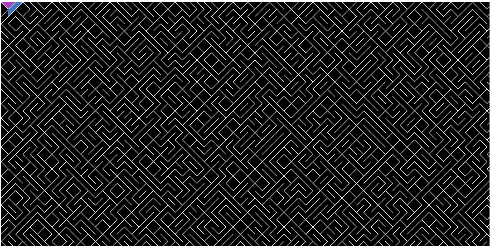

# An p5.js port to commodore one-line code: 10 PRINT CHR$(205.5+RND(1)); : GOTO 10

This p5.js sketch generate the Commodore one-line code: 10 PRINT CHR$(205.5+RND(1)); : GOTO 10
and after the maze is created, it starts crawling from the top inside the maze.
The colour palete are HSL 180 up to 290 (cyan to violet) in randomized choice.

This animation is on http://volfeganbox.byethost14.com/projects.html on the section 10 PRINT crawler.
 
            |\＼__／|\       ___| This is my 1st class based 
           ／___   ___＼    /   \ object oriented code written
        ／ （ ●） （ ●） ＼ /     \ only by me, not following a 
      ／:::⌒（__人__）⌒:::＼     \ a tutorial.
╲╲╱╲╲╲╱╲╲╱╲╱╲╱╲╲╲╱╱╱╲╱╱╱╱╲╱╱╱╲╲╲╱╲╱╲╲╲╲╲╱╱╲╱╲╲╲╲╱╱╲╲╲╲╱╱╲╲╲╲╱╱╲╲╱╱╲╲╲╲╲╲╲╱╱╱╲╱╲╱╲╲╲╱╲╲╱╱╲╲╲╲╱╲╱╲╲╲╱╲╱╲╲╱╱╱╲╲╱╱╲╱╱╱╲╲╱╲╲╱╱╲╲╲╲╲╲╲╱╱╱╲╲╱╲╲╲╲╲╲╲╱╱╱╱╱╱╲╲╱╲╱╱╱╲╲╲╲╲╱╱╲╱╱╲╱╱╱╱╲╱╲╱╲╲╱╲╱╲╱╲╱╲╱╱╲╲╱╲╲╱╱╲╱╱╲╲╱╱╱╲╱╲╱╲╲╲╱╱╲╱╲╱╲╱╱╱╲╲╲╲╱╱╱╲╲╱╲╱╲╱╱╲╲╲╲╲╲╱╲╱╲╱╲╱╲╲╲╲╲╱╲╲╲╲╱╲╱╱╲╲╱╲╱╲╱╲╲╲╱╲╱╲╱╱╲╱╲╲╱╲╲╲╲╱╱╲╲╱╱╲╲╲╱╲╱╲╱╱╲╱╲╲╲╱╲╲╱╱╲╲╱╲╱╱╲╱╲╲╱╱╲╲╲╱╲╱╱╱╲╲╲╱╱╲╱╲╱╱╲╱╱╱╲╱╱╱╱╲╱╱╱╲╲╱╱╲╲╱╲╱╱╱╲╱╱╲╲╱╱╱╱╱╲╲╲╲╱╱╲╲╱╱╲╲╲╱╱╲╲╲╲╲╱╲╲╱╱╲╱╲╱╱╲╲╱╱╲╲╱╲╲╱╲╱╲╲╱╱╱╲╱╱╱╱╱╱╱╱╱╲╲╲╱╱╲╱╲╱╲╱╱╲╱╱╱╱╲╱╱╲╲╲╲╱╲╱╱╱╲╱╲╱╱╱╲╲╲╱╲╲╲╲╱╲╲╲╱╲╲╲╱╱╱╲╲╲╱╲╲╱╱╱╲╱╲╱╲╲╲╱╱╲╲╲╲╱╱╱╱╲╲╲╲╲╲╱╲╲╲╲╲╲╲╲╱╱╲╲╲╱╱╲╱╲╲╲╱╲╲╱╱╲╲╲╱╲╱╲╱╲╱╲╲╲╲╲╱╱╱╲╲╲╲╲╱╲╲╱╱╱╱╱╱╱╲╲╱╲╲╲╲╱╲╲╲╲╱╲╱╱╱╲╱╱╲╲╲╲╱╲╱╱╲╲╲╲╲╲╱╱╱╱╲╲╲╱╲╲╱╱╱╲╱╱╱╲╲╲╲╲╱╱╱╲╱╲╲╲╲╱╱╲╲╲╲╱╱╲╱╲╱╲╲╲╱╱╱╱╱╲╲╱╲╲╲╲╲╲╲╱╱╲╱╱╲╲╲╱╲╱╱╱╱╱╱╱╱╲╱╲╱╱╲╲╲╱╲╲╲╲╱╱╱╱╲╱╱╱╲╲╱╲╱╲╲╲╱╱╱╲╱╲╲╱╱╱╱╲╱╱╲╲╲╱╱╲╱╱╱╱╲╱╲╱╲╲╱╲╲╱╱╱╱╱╱╱╱╲╱╲╲╱╱╲╱╱╱╱╲╲╱╲╲╲╱╱╱╲╲╲╲╱╲╱╱╱╲╲╲╲╱╲╲╱╲╲╱╱╱╱╲╲╲╲╱╱╲╲╲╱╱╱╲╱╱╱╱╲╱╲╱╲...

Use this program as you see fit.
